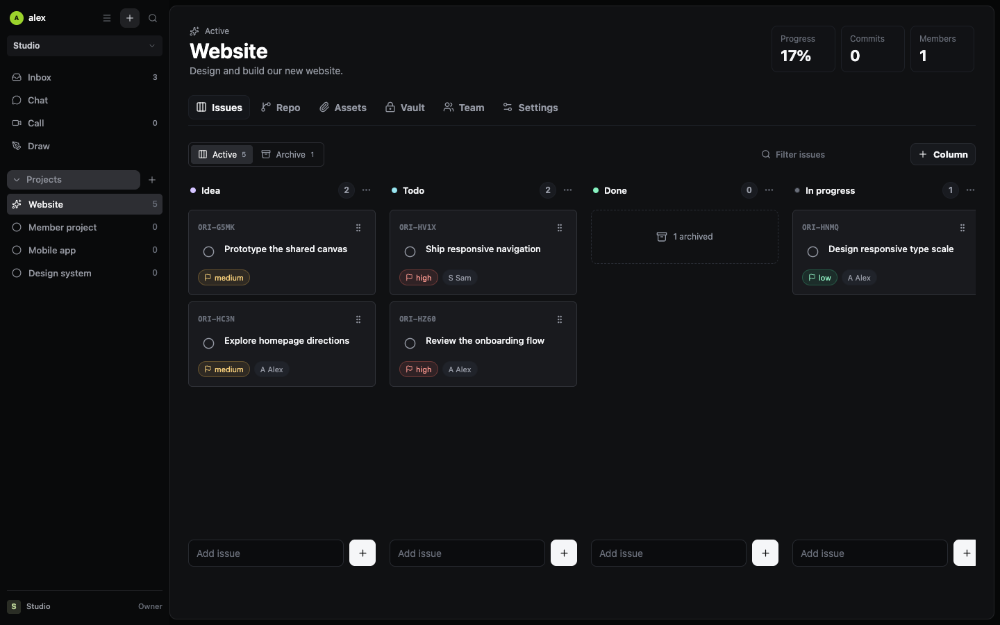

# Origin

**A shared workspace for the things your team is building.**

Projects, conversations, calls, drawings, documents, and releases. Connected to GitHub, without making GitHub your project manager.

[Try Origin](https://origin.imbored.fun) · [Self-host](deploy/README.md) · [Connect Claude or Codex](docs/claude-origin.md) · [Contribute](CONTRIBUTING.md)



## The Workspace

| Section | What you can do |
| --- | --- |
| Inbox | Assigned issues, filters, a week/month calendar, comments, mentions, snoozing, and completion activity. |
| Projects | Editable workflows, labels, sub-issues and dependencies, issue templates, due dates, assets, and an encrypted vault. |
| Chat | Workspace chat and DMs, full-history text search, attachments, mentions, reactions, pins, and message-to-issue creation. |
| Call | Audio, video, screen sharing, participant focus, and a self-hosted TURN relay. |
| Draw | A shared Excalidraw canvas with real-time editing and cursors. |
| Docs | Collaborative project documents, processes, and decisions. Turn selected text into an issue. |
| Roadmap | Cross-project milestones, target dates, linked issues, and completion progress. |
| Feedback | An opt-in public submission form. Triage privately and convert feedback into assigned issues. |
| Releases | Group completed issues into versioned releases and generate a workspace changelog. |

Completed issues stay accessible in each project's completed view. They do not occupy a kanban column or inflate the sidebar's open-issue count.

Notification settings include assignment/comment/mention preferences, muted projects, and time-zone-aware quiet hours for sounds. Dependencies organize related work without preventing an issue from being completed.

## Start Using Origin

1. Create an account and name your workspace. Its URL is `/<workspace-slug>`.
2. Invite your team by link, or email when the instance's mail service is configured.
3. Create a project and adapt its columns to your workflow.
4. Add issues with an assignee, priority, and due date. Your Inbox defaults to work assigned to you.
5. Optionally connect GitHub in workspace settings. New repositories are private by default.

Each workspace is private to its members. Publishing the source code does **not** publish workspace content. Public feedback portals expose only the title and description an admin explicitly enables, not internal issues or submitted feedback.

## GitHub, Without Double Entry

Connect the workspace administrator's GitHub account, then create private repositories from Origin. Existing repositories can be linked and approved individually.

Create an Origin issue, select **Create GitHub issue**, and implement it in the linked repository with your preferred tools. Closing the GitHub issue completes its Origin counterpart. Opening a pull request alone does not complete an issue.

Origin also exposes an OAuth-protected MCP endpoint at `/api/mcp`. AI clients can read projects and issues, and optionally create or modify them in a workspace you authorize. Access is revocable and expires. The connector does not expose chat, the vault, GitHub credentials, or arbitrary code execution. See the [MCP guide](docs/claude-origin.md).

## Run Locally

Requirements: Node.js 24+, npm, and a Convex deployment. No OpenAI or Anthropic API key is required.

```sh
git clone https://github.com/z4mbo/origin-workspace.git
cd origin-workspace
npm ci --legacy-peer-deps
cp .env.example .env.local
npx convex dev
```

Follow the Convex CLI setup and keep it running. It writes your deployment URL to `.env.local`. In a second terminal:

```sh
npm run dev
```

Open `http://localhost:3000/signup` and create your first workspace. There are no seeded accounts, default passwords, or bundled user data.

The board, documents, drawings, and account data use Convex. Chat, DMs, uploads, call signaling, and integration credentials use the Node server's local data directory. GitHub/MCP features need the shared integration secret described in the [deployment guide](deploy/README.md). Camera and screen capture require HTTPS outside localhost.

## Architecture

```text
Browser                         Next.js / Node server
  |                               |-- SQLite: chat, calls, integrations
  |                               |-- Local attachment files
  |                               |-- GitHub OAuth, webhooks, MCP
  |-- Convex: workspace data       |
  |-- WebRTC media <-------------->|-- Optional coturn relay
```

Next.js App Router, React, TypeScript, Convex, SQLite, WebRTC, Excalidraw, Yjs, and Lucide. Media travels peer-to-peer where possible and through your TURN server when needed. The standard setup uses managed Convex; deploying the web container alone does not self-host the Convex database.

## Development

```sh
npm run codegen
npx tsc --noEmit
npm run build
npx tsx scripts/test-document-sync.ts
npx tsx scripts/test-chat-composer.ts
npx tsx scripts/test-github-sync.ts
```

Integration tests create synthetic users and records and refuse non-localhost backends. See [testing](docs/testing.md). Never point development or test commands at a live workspace deployment.

## Status

Origin is an early public beta. It uses built-in email/password accounts; email verification, self-service password recovery, enterprise SSO, and an independently audited security certification are not provided. Email invites require a working SMTP service; link invitations work without it. Run your own security and operational review before relying on the app for sensitive or regulated data.

Report product bugs through GitHub issues. Do not put credentials or private workspace data in a public report. See [SECURITY.md](SECURITY.md) for vulnerability reporting.

## License

MIT. See [LICENSE](LICENSE). Third-party libraries and bundled assets retain their own licenses; see [THIRD_PARTY_NOTICES.md](THIRD_PARTY_NOTICES.md).
