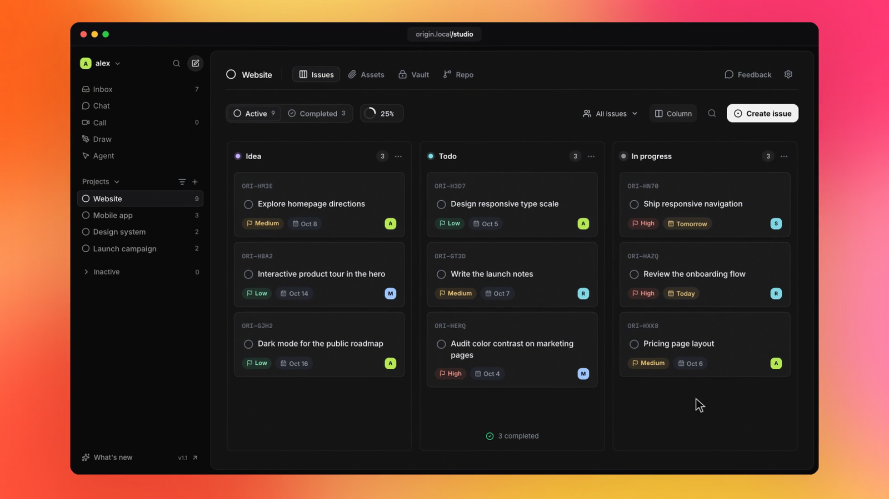
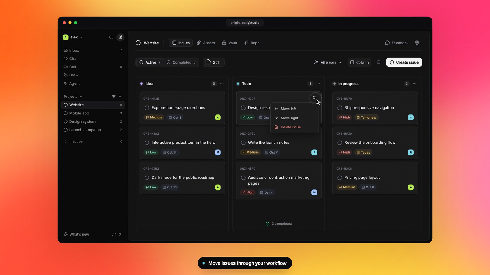
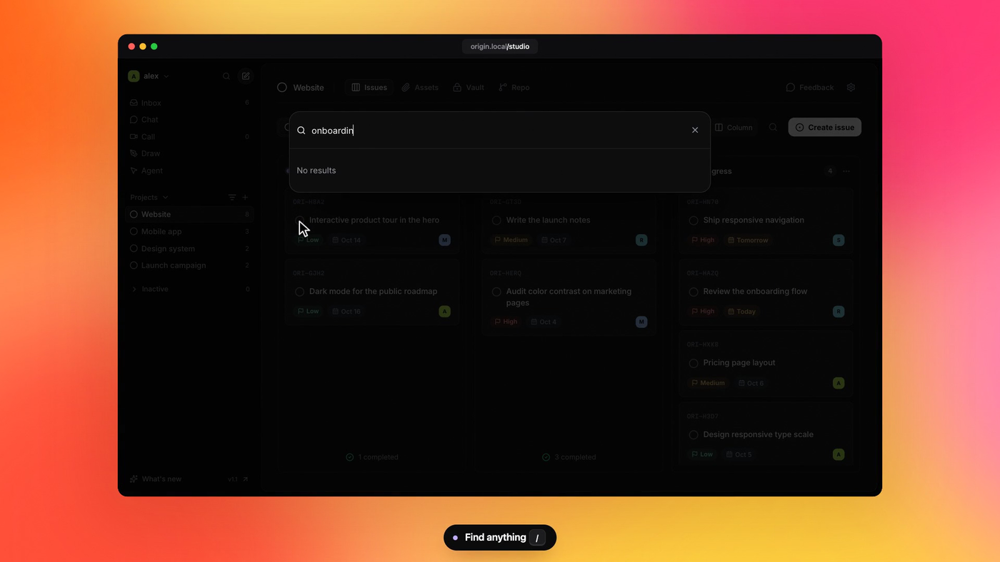
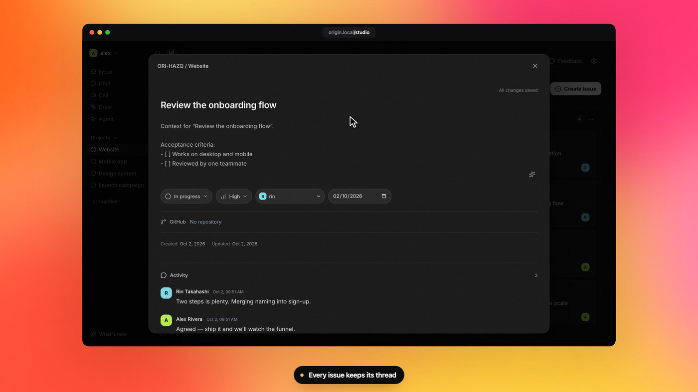
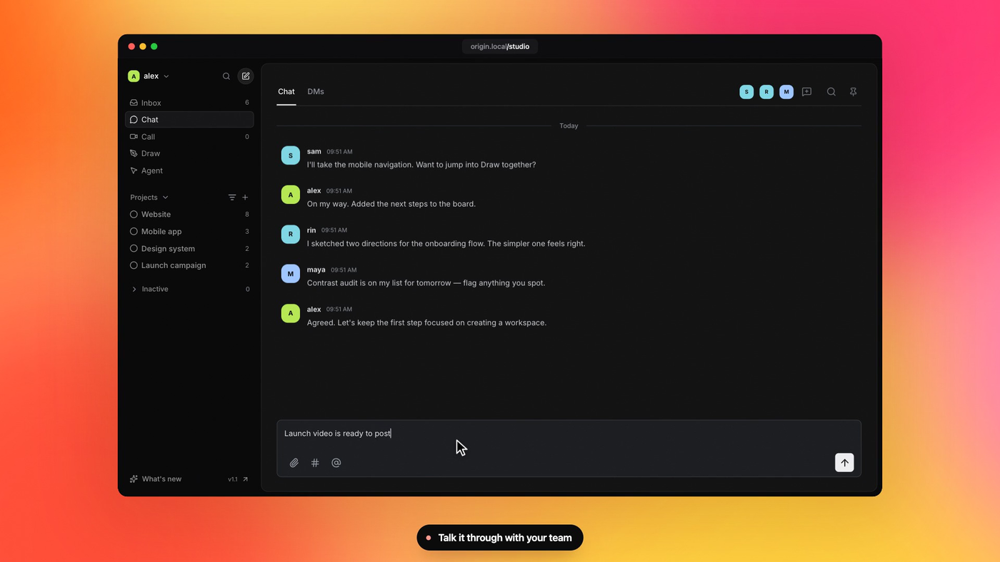
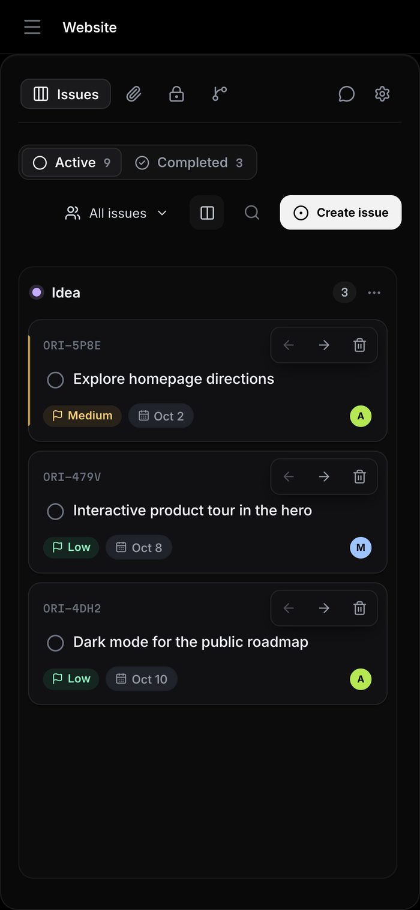

<div align="center">


<p align="center"><sub><a href="docs/assets/origin-launch.mp4">Watch the full video</a>: the workspace assembles, then moves issues, completes work, searches, opens a thread, and chats.</sub></p>

<h1>Origin</h1>

<p><strong>Your team's work, in one place.</strong><br />
Issues, chat, calls, and a shared canvas in one quiet workspace.<br />
Open source and self-hosted: run it on your own server, connected to GitHub and your AI agents.</p>

<p>
  <a href="#run-locally"><strong>Run locally</strong></a> ·
  <a href="deploy/README.md">Self-host</a> ·
  <a href="docs/claude-origin.md">Connect Claude or Codex</a> ·
  <a href="CONTRIBUTING.md">Contribute</a>
</p>

<p>
  
  
  
  
  
</p>

</div>

<br />

> **Origin is self-hosted.** There is no public hosted service to sign up for. You run your own instance, your workspace data stays on infrastructure you control, and this repository contains everything you need.



## The Workspace

| Section | What you can do |
| --- | --- |
| Inbox | Assigned issues, filters, a week/month calendar, comments, mentions, snoozing, and completion activity. |
| Projects | Editable workflows, labels, sub-issues and dependencies, due dates, image/file attachments, assets, and an encrypted vault. |
| Chat | Workspace chat and DMs, full-history text search, attachments, mentions, reactions, pins, and message-to-issue creation. |
| Call | Audio, video, screen sharing, participant focus, and a self-hosted TURN relay. |
| Draw | A shared Excalidraw canvas with real-time editing and cursors. |
| Agent | One workspace assistant, with approved changes and issue rewriting. Connect Codex locally or on your private server, or use your own OpenAI, Anthropic or OpenRouter API key. |
| Project feedback | A dedicated tab in each project, with an opt-in public submission form. Triage privately and convert feedback into assigned issues. |

Completed issues stay accessible in each project's completed view. They do not occupy a kanban column or inflate the sidebar's open-issue count.

Notification settings include assignment/comment/mention preferences, muted projects, and time-zone-aware quiet hours for sounds. Dependencies organize related work without preventing an issue from being completed.

## Motion and Design

Origin is black, flat, and quiet. Color appears only where it carries meaning: workflow lanes, priority, due dates, and the people on your team. No gradients, no glass, no blur.

The interface moves the way the work does:

- **Issues glide.** Cards animate from where they were to where they land, whether you drag them, reorder them, or a teammate moves them in real time.
- **Completing is a moment.** Check off an issue and it bursts, lifts, and flies into the Completed count while the rest of the column closes the gap.
- **Selection slides.** The active view, project, and board tab share a single highlight that travels between them.
- **Boards arrive in order.** Columns and cards enter in a short stagger when you open a project; counters bump when they change.
- **Every card reads at a glance.** Priority, due-date chip (today, tomorrow, overdue), assignee avatar, and a mono issue key.
- **Keys for everything common.** <kbd>C</kbd> creates an issue, <kbd>/</kbd> or <kbd>⌘</kbd><kbd>K</kbd> opens search.

Motion respects the reduced-motion setting of your system; with it on, everything stays put.

<table>
  <tr>
    <td width="50%"></td>
    <td width="50%"></td>
  </tr>
  <tr>
    <td width="50%"></td>
    <td width="50%"></td>
  </tr>
</table>

<p align="center"></p>

## Start Using Origin

1. Run your instance ([locally](#run-locally) or [on a server](deploy/README.md)), then create an account and name your workspace. Its URL is `/<workspace-slug>`.
2. Invite your team by link, or email when the instance's mail service is configured.
3. Create a project and adapt its columns to your workflow.
4. Add issues with an assignee, priority, and due date. Your Inbox defaults to work assigned to you.
5. Optionally connect GitHub in workspace settings. New repositories are private by default.

### Invite-only instances

Set `ORIGIN_SIGNUP_MODE=invite` in your Convex deployment's environment to stop open sign-ups. New accounts can then only be created from an invitation link, while existing members keep working as usual:

```sh
npx convex env set ORIGIN_SIGNUP_MODE invite
```

Each workspace is private to its members. Publishing the source code does **not** publish workspace content. Public feedback portals expose only the title and description an admin explicitly enables, not internal issues or submitted feedback.

## GitHub, Without Double Entry

Connect the workspace administrator's GitHub account, then create private repositories from Origin. Existing repositories can be linked and approved individually.

Create an Origin issue, select **Create GitHub issue**, and implement it in the linked repository with your preferred tools. A small branch icon marks linked issues. Closing the GitHub issue completes its Origin counterpart. Opening a pull request alone does not complete an issue.

Origin also exposes an OAuth-protected MCP endpoint at `/api/mcp`. AI clients can read projects, issues and inbox events, and optionally create, modify, complete or delete issues in a workspace you authorize. Access is revocable and expires. The connector does not expose chat contents, the vault, GitHub credentials, or arbitrary code execution. See the [MCP guide](docs/claude-origin.md) and [Codex plugin](plugins/origin).

Prefer staying inside Origin? Open **Agent** and choose a [local or server companion](docs/agent.md),
or an admin-supplied API key. Admins can share a runner with their workspace while
each member keeps their own data permissions. Every change needs approval.
Repository coding is not enabled yet.

## Run Locally

Requirements: Node.js 24+, npm, and a Convex deployment. No OpenAI or Anthropic API key is required.

```sh
git clone https://github.com/z4mbo/origin-workspace.git
cd origin-workspace
npm ci --legacy-peer-deps
cp .env.example .env.local
npx convex dev
```

Follow the Convex CLI setup and keep it running. It writes your deployment URL to `.env.local`. In a second terminal:

```sh
npm run dev
```

Open `http://localhost:3000/signup` and create your first workspace. There are no seeded accounts, default passwords, or bundled user data.

The board, drawings, feedback, and account data use Convex. Chat, DMs, issue attachments, call signaling, and integration credentials use the Node server's local data directory. Project assets use Convex storage. GitHub/MCP features need the shared integration secret described in the [deployment guide](deploy/README.md). Camera and screen capture require HTTPS outside localhost.

## Architecture

```text
Browser                         Next.js / Node server
  |                               |-- SQLite: chat, calls, integrations
  |                               |-- Local attachment files
  |                               |-- GitHub OAuth, webhooks, MCP
  |-- Convex: workspace data       |
  |-- WebRTC media <-------------->|-- Optional coturn relay
```

Next.js App Router, React, TypeScript, Convex, SQLite, WebRTC, Excalidraw, Yjs, and Lucide. Media travels peer-to-peer where possible and through your TURN server when needed. The standard setup uses managed Convex; deploying the web container alone does not self-host the Convex database.

## Development

```sh
npm run codegen
npx tsc --noEmit
npm run build
npx tsx scripts/test-document-sync.ts
npx tsx scripts/test-chat-composer.ts
npx tsx scripts/test-github-sync.ts
npx tsx scripts/test-call-signaling.ts
npx tsx scripts/test-dropped-content.ts
```

Integration tests create synthetic users and records and refuse non-localhost backends. See [testing](docs/testing.md). Never point development or test commands at a live workspace deployment.

## Status

Origin is an early public beta. It uses built-in email/password accounts; email verification, self-service password recovery, enterprise SSO, and an independently audited security certification are not provided. Email invites require a working SMTP service; link invitations work without it. Run your own security and operational review before relying on the app for sensitive or regulated data.

Report product bugs through GitHub issues. Do not put credentials or private workspace data in a public report. See [SECURITY.md](SECURITY.md) for vulnerability reporting.

## License

MIT. See [LICENSE](LICENSE). Third-party libraries and bundled assets retain their own licenses; see [THIRD_PARTY_NOTICES.md](THIRD_PARTY_NOTICES.md).
